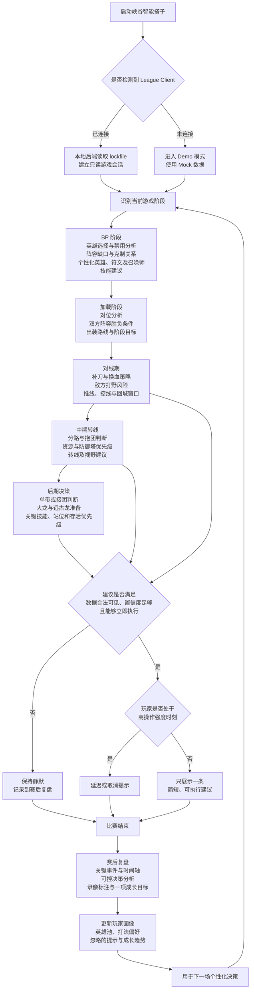
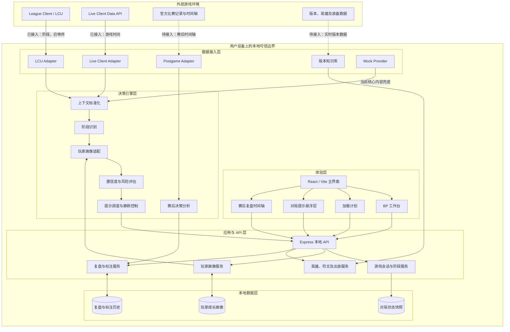

# 产品流程与架构

## 产品核心流程

## 产品架构

## 架构说明

产品采用前端体验层、本地应用与 API 层、决策引擎层、数据接入层和本地存储层组成的分层架构。整体以用户设备本地运行为主，游戏客户端凭据和个人对局数据不需要暴露给浏览器。

体验层由 React 和 Vite 实现，负责 BP、加载、对局提示及赛后复盘等界面。前端仅通过本地 API 获取标准化后的会话状态和决策结果，不直接连接 League Client。

应用与 API 层由 Express 提供统一服务入口，管理游戏会话、玩家画像、英雄构筑和复盘标注。它同时构成安全边界：LCU 的认证信息只在本地后端内存中使用，不返回给前端。

决策引擎将游戏数据转换为适合当前阶段的行动建议。引擎先标准化上下文并识别阶段，再结合玩家画像评估建议的置信度、风险和可执行性。对局中处于高操作强度或依据不足时，提示调度器会延迟提示或保持静默，将相关问题留到赛后复盘。

数据接入层通过适配器隔离不同数据源。目前 Demo 已接入 LCU 游戏阶段、当前召唤师以及 Live Client Data 的游戏时间；BP 实时状态、完整对局事件、资源与视野信息、赛后时间轴和实时版本数据仍需继续接入。Mock Provider 在客户端不可用或适配器尚未完成时提供演示数据。

本地存储保存会话快照、玩家成长画像以及复盘标注历史。赛后分析结果会更新玩家画像，并在下一场比赛中影响提示内容和优先级，从而形成跨对局的持续成长闭环。

系统默认只读，不执行自动选人、自动禁用、自动购买、角色控制或战争迷雾信息推断。
